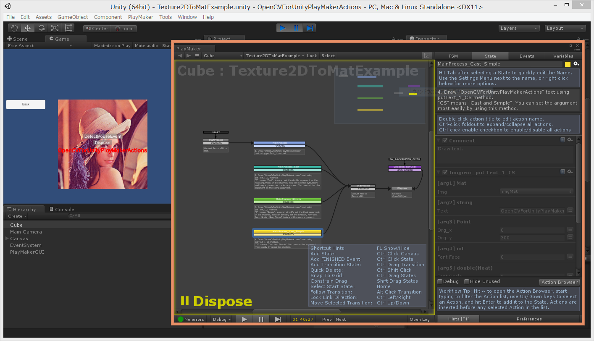
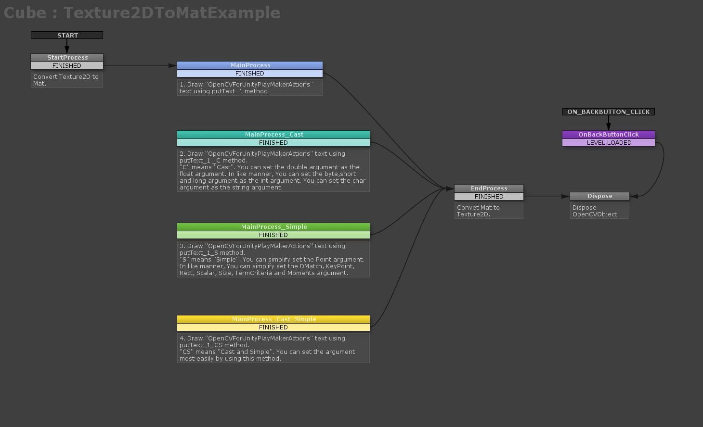
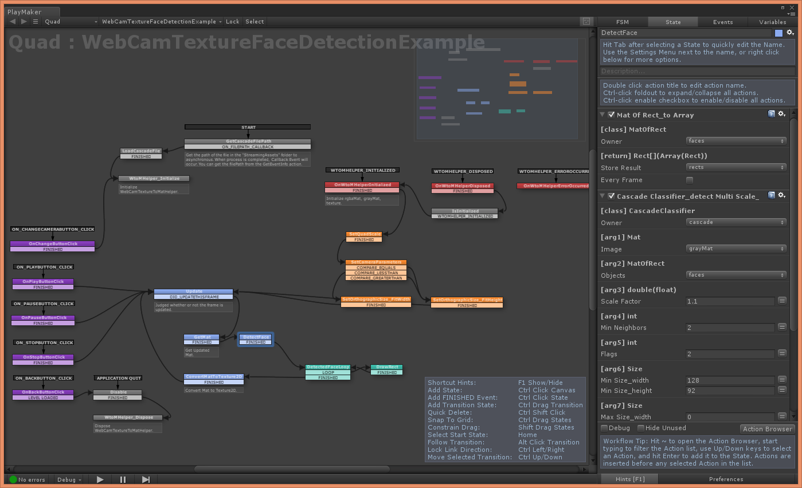

OpenCVForUnityPlayMakerActions
====================

Overview
-----
<https://www.assetstore.unity3d.com/#!/content/94516>  

Manual
-----
[ReadMe.pdf](/Assets/OpenCVForUnityPlayMakerActions/ReadMe.pdf)

